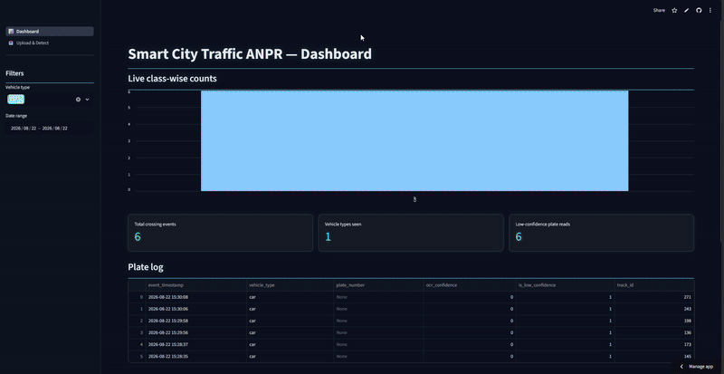

# Smart City Traffic ANPR System

**Live demo:** https://smart-city-traffic-anpr-system-q5skn4nku6cqwkuukr4mam.streamlit.app/

Real-time traffic monitoring pipeline: YOLOv8 vehicle detection → tracking →
line-crossing vehicle counts → license plate OCR → SQLite → Streamlit dashboard.
Built pretrained-first (no custom training) for a smart-city ANPR use case.



## Architecture

```
Video Input
  → Frame Extraction (OpenCV)
  → YOLOv8 Vehicle Detection (pretrained, COCO)
  → DeepSORT / ByteTrack Tracking (unique ID per vehicle)
  → Line Crossing Detection (centroid-based)
  → License Plate Detection (YOLO ANPR model)
  → OCR (EasyOCR / Tesseract)
  → Database (SQLite → PostgreSQL later)
  → Dashboard (Streamlit) / Service (FastAPI)
```

Full requirements and design rationale: [docs/SPEC.md](docs/SPEC.md),
[docs/decisions.md](docs/decisions.md).

## Features

- Detects vehicle classes (car, bike, truck, bus) in video with pretrained YOLOv8
- Assigns a persistent tracker ID per vehicle across frames
- Counts each vehicle exactly once, on virtual-line crossing (not per-frame presence)
- Runs plate detection + OCR only on crossing events, not every frame
- Stores vehicle type, plate number (with confidence flag for low-confidence reads),
  and timestamp in SQLite (`database/schema.sql`)
- Streamlit **Dashboard** page for live/historical counts and plate logs (DB-only, read-only)
- Streamlit **Upload & Detect** page for ad hoc image/video uploads outside the CLI pipeline

## Known limitations

- No dedicated license-plate detector model is bundled — no no-auth-required pretrained
  weights could be sourced at build time. `pipeline/plate_detection.py` falls back to
  OCR-ing the lower third of each vehicle's bounding box. Drop real weights at
  `models/plate_model.pt` to use a real detector; no code changes needed.
- Plate OCR accuracy is low in this configuration as a direct result of the above.
- Runs on CPU (the installed `torch` build is CPU-only). Works, just slow.

See [docs/decisions.md](docs/decisions.md) (D-011, D-013) for details.

## Setup

```bash
pip install -r requirements.txt
```

Set `KMP_DUPLICATE_LIB_OK=TRUE` in the environment before running anything that imports
`torch` (this Anaconda install links two OpenMP runtimes and crashes on import otherwise).

`ffmpeg` on PATH is optional but recommended: the Upload & Detect page's in-browser video
preview needs it to transcode the pipeline's mp4v output to browser-playable H.264. Without
it, the preview player is skipped but the download button still works.

## Usage

```bash
# run the full pipeline on a video (writes output video, CSV log, and DB rows)
python -m pipeline.run_pipeline --source data/videos/traffic.mp4
# optional: --db, --output-video, --output-csv, --line-ratio (virtual line y-position, 0-1)

# launch the dashboard (reads database/traffic.db)
streamlit run app/streamlit_app.py

# purge vehicle_events rows older than N days (retention policy)
python -m pipeline.purge --db database/traffic.db --days 30
```

Test suite: `python -m pytest` (bare `pytest` won't resolve `import pipeline` without an installed
package — see `tests/conftest.py`). CI (`.github/workflows/ci.yml`) runs a clean install + full
test suite on every push/PR.

## Tech stack

Python, OpenCV, YOLOv8, DeepSORT/ByteTrack, EasyOCR/Tesseract, FastAPI, Streamlit,
SQLite (→ PostgreSQL later).

## Project status & privacy

This is a v1 build, deployed live on Streamlit Community Cloud (see link at the top). Plate
numbers and any frame with a readable plate are treated as PII — raw sample footage, exported
logs with real plates, and DB dumps are never committed (see `.gitignore`).

**Data retention**: `vehicle_events` rows older than 30 days are purged via
`python -m pipeline.purge` (see [docs/decisions.md](docs/decisions.md) D-024, resolving
[docs/blocked.md](docs/blocked.md) B-003) — but the purge is manual/externally-scheduled, not
automatic yet.

## Repo layout

```
├── app/                  # Streamlit dashboard + upload/detect pages
├── database/             # schema.sql (source of truth) + local traffic.db (gitignored)
├── docs/                 # SPEC, rules, decisions, blocked questions
├── models/               # YOLO weights (gitignored)
├── pipeline/             # detection, tracking, line-crossing, plate OCR, storage, run_pipeline
├── data/, output/        # inputs/outputs (gitignored)
└── requirements.txt
```
